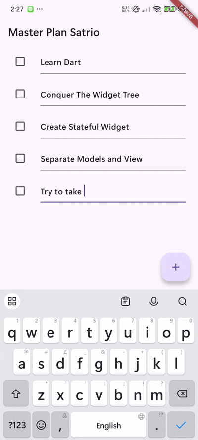
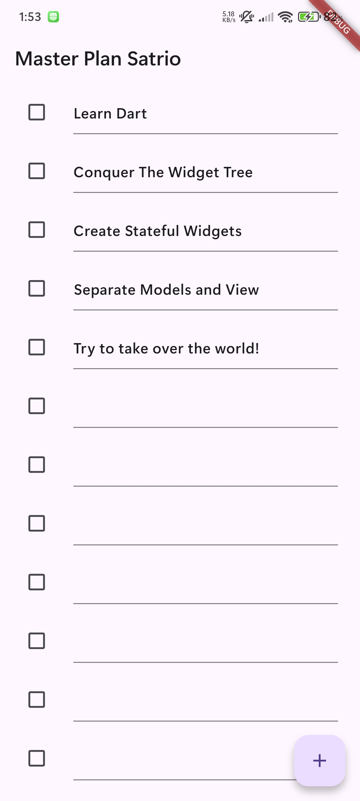
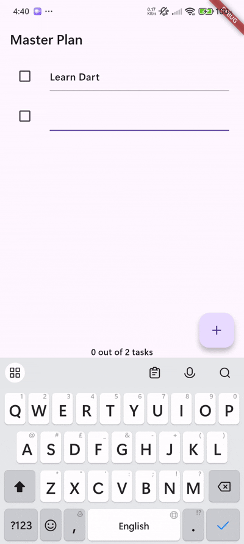
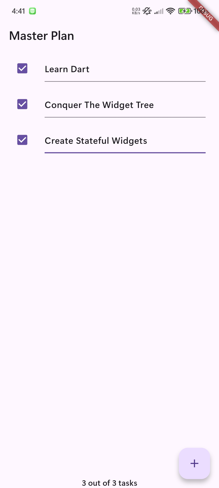

# master_plan

Tampilan akhir pada aplikasi Flutter setelah berhasil menyelesaikan Praktikum 1: Dasar State dengan Model-View

Tampilan akhir pada aplikasi Flutter setelah berhasil menyelesaikan Praktikum 2: Mengelola Data Layer dengan InheritedWidget dan InheritedNotifier
Terdapat perbedaan tampilan UI yaitu pada bagian bawah terdapat teks yang menunjukkan jumlah tugas yang sudah diselesaikan dari total semua tugas yang terdapat dalam list

